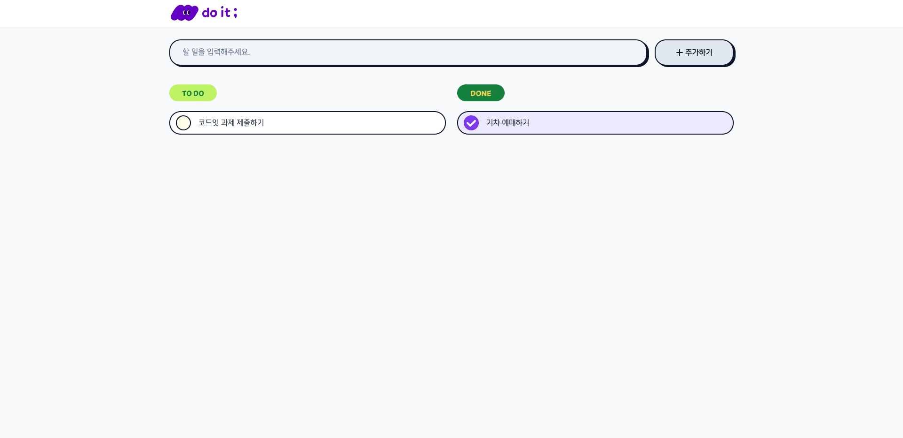
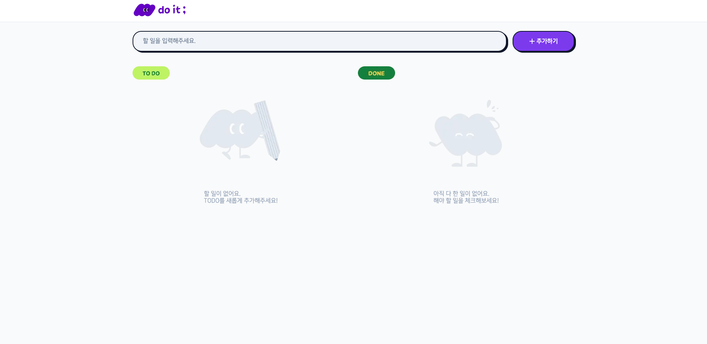
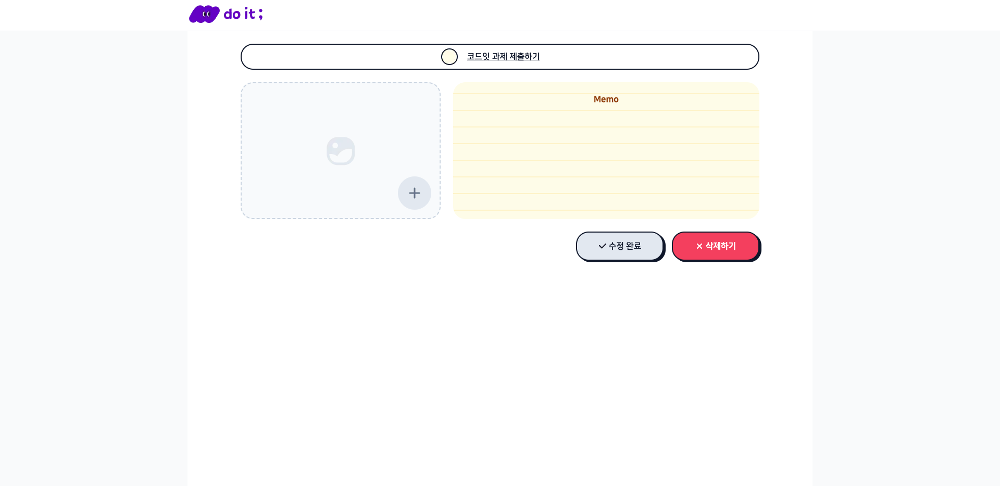
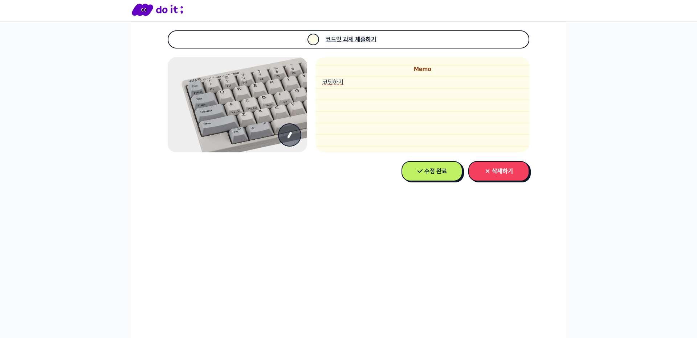
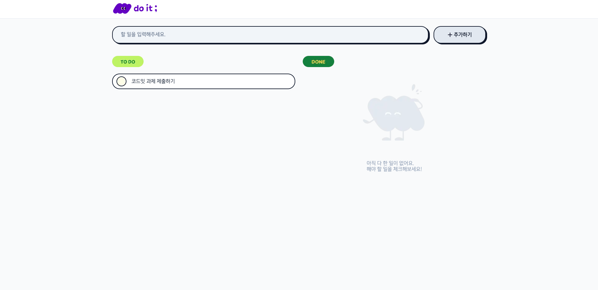

# 프로젝트 설명

이 프로젝트는 코드잇 스프린트 과제로, Next.js와 TypeScript를 활용하여 "할 일 목록(Todo List)" 애플리케이션을 반응형 웹페이지로 구현했습니다. 사용자는 할 일을 추가, 수정, 삭제할 수 있으며, 이미지 업로드 기능도 포함되어 있습니다.
<br/>

[프로젝트 링크](https://codeit-todo-list-4r4em67t3-taehuns-projects-1fcb6cd3.vercel.app/)
<br/>

# 주요 기능

- 할 일 추가: 메인 페이지에서 할 일을 입력하고 추가 버튼을 클릭합니다.
- 할 일 완료 상태 변경 : 할 일 항목의 체크박스를 클릭하여 할 일과 완료한 일을 변경합니다.
- 할 일 수정: 할 일 항목을 클릭하여 상세 페이지로 이동한 후, 내용을 수정하고 저장 버튼을 클릭합니다.
- 할 일 삭제: 할 일 항목 옆의 삭제 버튼을 클릭하여 할 일을 삭제합니다.
- 이미지 업로드: 할 일 상세 페이지에서 이미지를 업로드할 수 있습니다.

<br/>

### 할 일 추가

- 상단 입력창에 글자를 입력 후 '추가하기'버튼을 클릭하거나 엔터키를 누르면 할 일이 추가됩니다.
- 추가된 할 일은 입력창 하단에 할 일 리스트에 추가되고 할 일과 완료한 일 리스트가 구분되어 있습니다.
- TODO의 체크박스를 클릭하면 진행 상태가 변경되고 각 리스트에 이동합니다.
  
- TODO목록이 없는 경우 대체 이미지를 보여주고 '추가하기' 버튼 색상을 강조합니다.
  

### 할 일 수정

- 추가한 TODO의 텍스트를 클릭하면 상세페이지로 이동합니다.
- TODO의 이름, 이미지, 메모를 보여줍니다.
- 추가한 이미지가 없을 시 대체 이미지로 보여줍니다.
  
- 이미지를 첨부하거나 이름, 메모를 변경하면 수정하기 버튼이 활성화되고 버튼을 클릭 시 TODO가 수정됩니다.
- TODO 이름 옆에 체크박스를 클릭 시 이전 페이지와 동일하게 TODO 상태가 변경됩니다.
- 내용을 변경하지 않고 버튼을 클릭 시 알람을 띄웁니다.
  

### 할 일 삭제

- TODO 상세 페이지에서 삭제하기 버튼을 클릭 시 확인창이 뜨고 확인을 클릭하면 TODO가 삭제됩니다.
  
  

<br/>

# 프로젝트 구조

```text
📂public
 ┣ 📂icons       // 아이콘 이미지 파일
 ┣ 📂images      // 이미지 파일
📂src
 ┣ 📂actions     // server action 함수 파일 (* 주석)
 ┣ 📂api         // API 요청 함수 파일       (* 주석)
 ┣ 📂components  // UI components 파일     (* 주석)
 ┃ ┗ 📂css       // UI components CSS 파일
 ┣ 📂app
 ┃ ┗ 📂todo/[id] // todo 상세 페이지         (* 주석)
```
